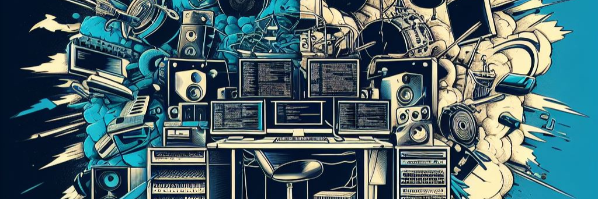

## About 🖥️🥁 
Hello! My name is Riley Clark. I am an aspiring software developer based in Winnipeg, Manitoba.

I am currently studying software development at the Manitoba Institute of Trades and Technology (MITT), specializing in full-stack development.
I enjoy my work as a student creating websites that are not only beautiful, but fully functional as well! In my spare time, I enjoy gaming, playing the drums,
and listening to any and all kinds of music.

Currently, my focus is on back-end development using: C#, with .NET frameworks, and SQL integration, but I also know HTML, CSS, and JavaScript as well!

Feel free to check out some of my work! | <a style="color:#2aa889" href="https://rileyclark.work" target="_blank">rileyclark.work</a>

##

### Skills 💡✍️

  
  
  
  
  
  
  

##

##

## Contact 📫
Have a question, or want to know more?

<b>Shoot me a message!</b>
 
📧 Email: [r1l3ycl4rk@gmail.com](mailto:r1l3ycl4rk@gmail.com) 
 

##
