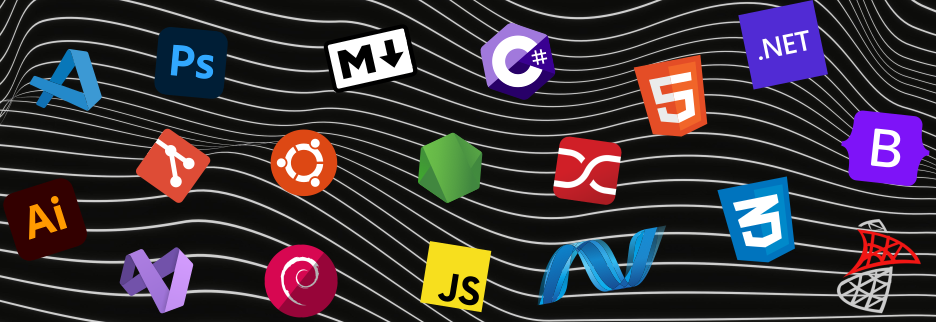

  

## About 🖥️🥁 
Hello! My name is Riley Clark. I am a full-stack software developer based in Winnipeg, Manitoba.

I am currently working at <a href="https://home.farmmedia.com/" target="_blank">Glacier FarmMedia</a> as a Digital Campaign Co-ordinator creating email promotionals, but nonetheless, I have some side projects I enjoy working on!

Be sure to check out my skills section to see what I know!

Feel free to check out some of my work! | <a style="color:#2aa889" href="https://rileyclark.work" target="_blank">rileyclark.work</a>

##

### Technical Skills 💡✍️
  
<h3>Languages / Lightweights</h3>

  

    
    
    
    
    
    
  

  
<h3>Frameworks</h3>

  

    
    
    
    
    
  

  
<h3>Applications / Operating Systems</h3>

  
    
    
    
    
    
    
    
    
    
    
    
    
  

##
&nbsp;

##

## Contact 📫
Have a question, or want to know more?

<b>Shoot me a message!</b>
 
📧 Email: [rileyclarky@gmail.com](mailto:rileyclarky@gmail.com)
 
⛓️ LinkedIn: [riley-ad-clark](https://www.linkedin.com/in/riley-clark-5862202b5/)
 

##
